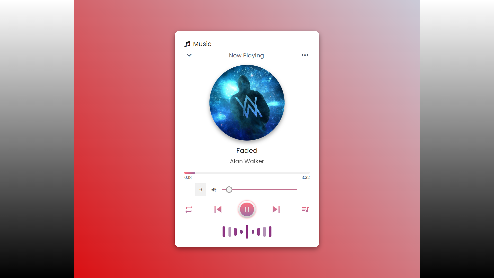
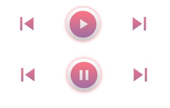
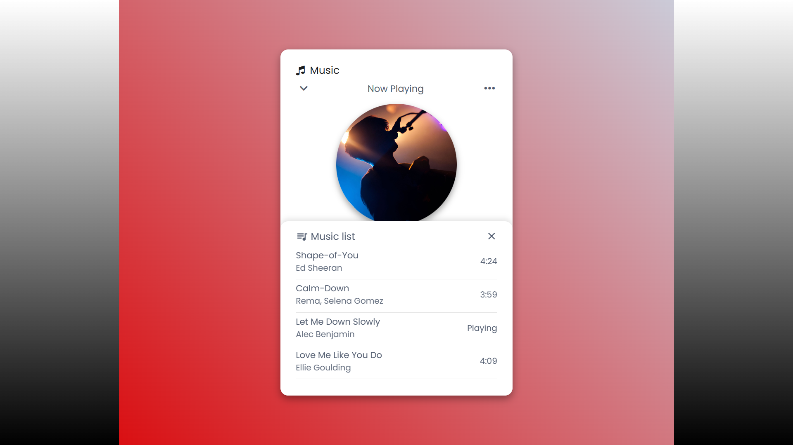

# Ultimate-Music-Player [](https://twitter.com/share?url=https://github.com/ashishkumarrsm/Music-Player) [](https://www.linkedin.com/shareArticle?mini=true&url=https://github.com/ashishkumarrsm/Music-Player)

## Screenshot
<p>
    <a href="https://youtu.be/lcMNFBXV2d4" target="_blank"></a>
</p>

## Functions:
### Modes:
- Repeat mode -> playlist looped
- Repeat-one mode -> song looped
- Shuffle mode -> playback shuffled
<p>
    
</p>

### Buttons:
- Play button
- Pause button
- Next song button
- Previous song button
<p>
    
</p>

### Display Feature:
- Sound line bars are displayed only when the song is playing. If the song is paused, the bars will disappear.
- Music image is rotating when music is playing. If the song is paused, the image rotation stops and returns to the original position.
<div>
    
    
</div>

### Other functionality:
- Progressive drag progress bar on song timeline.
- Sound range slider.
- Current time of the song is updated per second.
<p>
    <a href="https://github.com/ashishkumarrsm/Music-Player/blob/main/readme_img/drag_range_slider.jpg"></a>
</p>

### Additional Features:
- Music list containing the list of songs with the artist's name and duration of the song.
- Upon clicking any song on the list, the song will start playing.
- The song currently being played will be displayed as "now playing."
- Every time you open the website, a random song is played.
<p>
    <a href="https://github.com/ashishkumarrsm/Music-Player/blob/main/readme_img/music-list.png"></a>
</p>

### Built With:
<div>
    
    
    
</div>
<br>

**Live Demo**: https://ashishkumarrsm.github.io/Music-Player/

## Author

👤 **Ashish Kumar**

- Github: [@ashishkumarrsm](https://github.com/ashishkumarrsm)
- Twitter: [@Ashi010702Kumar](https://x.com/Ashi010702Kumar)
- LinkedIn: [Ashish Kumar](https://www.linkedin.com/in/ashish-kumar-476178259/)

### Prerequisites

Before you begin, ensure you have met the following requirements:

* [Git](https://git-scm.com/downloads) must be installed on your operating system.

### Run Locally

To run **Ultimate-Music-Player** locally, run this command on your git bash:

Linux and macOS:

```bash
sudo git clone https://github.com/ashishkumarrsm/Music-Player.git


Windows:

git clone https://github.com/ashishkumarrsm/Music-Player.git


📌NOTE: If you want to add more songs, you just need to add songs to the songs folder and add images of the music in the images folder, then add a list item in the list of the music-list.js file. That's all, nothing more to do.
